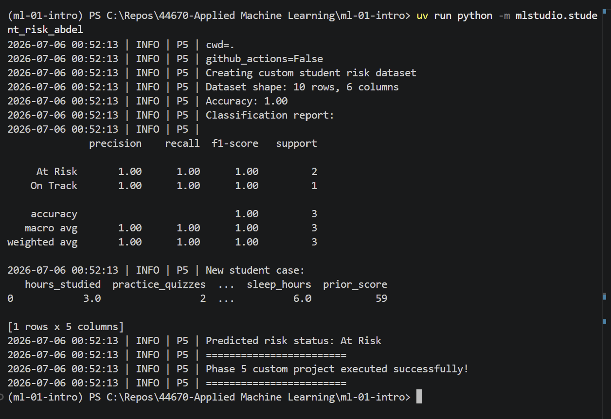

# Project Documentation

This site provides project documentation.
Use the documentation navigation to explore.

## How-To Guide

Many instructions are common to all our projects.

See
[⭐ **Workflow: Apply Example**](https://denisecase.github.io/pro-analytics-02/workflow-b-apply-example-project/)
to get the example projects running on your machine.

## Project Documentation Pages (docs/)

- **Home** - this documentation landing page
- [**Project Instructions**](./project-instructions.md) - the standard project workflow
- [**Your Files**](./your-files.md) - how to copy the example and create your version
- [**Glossary**](./glossary.md) - project terms and concepts
- [**API**](./api.md) - autogenerated code documentation for the public project interface

---

## Phase 4. Technical Modification

For my technical modification, I created a copy of the original regression
application and named it `app_abdel.py`. I added a new
**Actual Scores vs Predicted Scores** visualization to improve the evaluation
of the regression model.

I chose this modification because the original project reported Mean Absolute
Error and R-squared in the project log, but I wanted to visually compare the
actual test scores with the model predictions.

To implement the change, I modified the training function to return the test
target values and predicted values. I then created a new plotting function that
displays actual scores against predicted scores with a reference line.

I verified the modification by running:

```shell
uv run python -m mlstudio.app_abdel
```

The project executed successfully and produced three charts instead of the
original two. The new Actual Scores vs Predicted Scores chart showed that the
predicted values were very close to the actual test values.

I would rate this modification as moderate because I needed to change how
results were returned from the training function, pass those results through
the main workflow, and use them in a new visualization.

## Phase 5: Student Performance Risk Classification

For my custom machine learning project, I changed the problem from regression
to classification. The provided example predicts a numeric student score,
while my project classifies students as either **At Risk** or **On Track**.

I used five features: hours studied, number of practice quizzes, attendance
percentage, sleep hours, and prior score. The target variable is `risk_status`.

I trained a Decision Tree Classifier and evaluated the model using accuracy,
precision, recall, and F1-score. The model achieved 1.00 accuracy on the small
test set. However, the dataset contains only 10 records, so this result should
be interpreted as a demonstration of the classification workflow rather than
evidence of production-level model performance.

The model also predicted a new student case with 3 hours of study, 2 practice
quizzes, 76% attendance, 6 hours of sleep, and a prior score of 59 as
**At Risk**.

### Run the Custom Project

```shell
uv run python -m mlstudio.student_risk_abdel
```

### Basis and Data

I started with the student performance concept used in the original
`hours_scores_case` example. The original dataset includes student-related
variables such as hours studied, practice quizzes, attendance percentage,
sleep hours, prior score, and final score.

For my custom project, I created a small student risk dataset with 10 records
and used similar student performance features. I changed the target from a
numeric score to a categorical variable named `risk_status`.

I chose this approach because I wanted to explore a classification problem
while keeping the student performance context of the original project. An
important limitation is the small dataset size. The project is intended to
demonstrate the machine learning classification workflow and should not be
considered a production-ready student risk model.

### Modeling Approach

This is a supervised machine learning classification problem because the
training data contains a known target variable, `risk_status`. Each student is
labeled as either **At Risk** or **On Track**, and the model learns patterns
from these labeled examples.

I used a Decision Tree Classifier because the target is categorical. The model
uses hours studied, practice quizzes, attendance percentage, sleep hours, and
prior score as features to predict the student's risk category.

I split the data into training and testing sets using a 70/30 split and a
random state of 42 for reproducibility. I evaluated the model using accuracy,
precision, recall, and F1-score.

### Summary

I implemented a custom student performance risk classification project using
a Decision Tree Classifier. I created a categorical target variable and
trained the model to classify students as either **At Risk** or **On Track**.

The model achieved 1.00 accuracy on the small test set and classified the new
student example as **At Risk**. Because the dataset contains only 10 records,
the results are limited and should be interpreted as a demonstration of the
workflow.

This project helped me better understand the difference between regression
and classification. The original example predicts a continuous numeric score,
while my custom project predicts a category. I also practiced selecting
features, defining a target variable, splitting data into training and testing
sets, training a supervised model, and evaluating classification results.

These skills could be applied to real problems such as identifying students
who may need academic support, predicting customer risk categories,
classifying equipment conditions, or supporting other data-driven
decision-making processes.

### Project Result

The project executed successfully and predicted the new student case as
**At Risk**.


